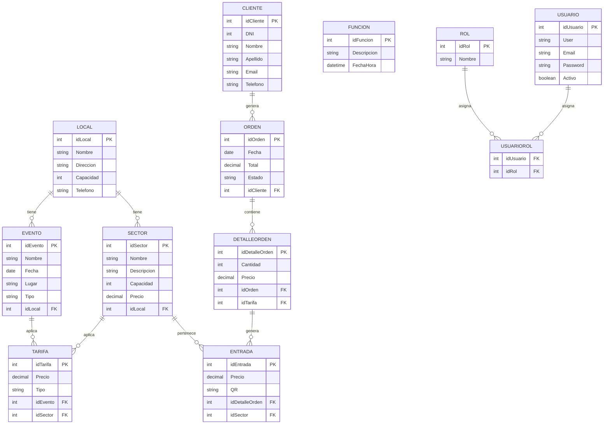

```mermaid
erDiagram
    LOCAL {
        int idLocal PK
        string Nombre
        string Direccion
        int Capacidad
        string Telefono
    }

    SECTOR {
        int idSector PK
        string Nombre
        string Descripcion
        int Capacidad
        decimal Precio
        int idLocal FK
    }

    EVENTO {
        int idEvento PK
        string Nombre
        date Fecha
        string Lugar
        string Tipo
        int idLocal FK
    }

    CLIENTE {
        int idCliente PK
        int DNI
        string Nombre
        string Apellido
        string Email
        string Telefono
    }

    ORDEN {
        int idOrden PK
        date Fecha
        decimal Total
        string Estado
        int idCliente FK
    }

    DETALLEORDEN {
        int idDetalleOrden PK
        int Cantidad
        decimal Precio
        int idOrden FK
        int idTarifa FK
    }

    ENTRADA {
        int idEntrada PK
        decimal Precio
        string QR
        int idDetalleOrden FK
        int idSector FK
    }

    TARIFA {
        int idTarifa PK
        decimal Precio
        string Tipo
        int idEvento FK
        int idSector FK
    }

    FUNCION {
        int idFuncion PK
        string Descripcion
        datetime FechaHora
    }

    USUARIO {
        int idUsuario PK
        string User
        string Email
        string Password
        boolean Activo
    }

    ROL {
        int idRol PK
        string Nombre
    }

    USUARIOROL {
        int idUsuario FK
        int idRol FK
        %% PK compuesta: idUsuario + idRol
    }

    %% Relaciones
    LOCAL ||--o{ SECTOR : tiene
    LOCAL ||--o{ EVENTO : tiene
    CLIENTE ||--o{ ORDEN : genera
    ORDEN ||--o{ DETALLEORDEN : contiene
    DETALLEORDEN ||--o{ ENTRADA : genera
    SECTOR ||--o{ ENTRADA : pertenece
    EVENTO ||--o{ TARIFA : aplica
    SECTOR ||--o{ TARIFA : aplica
    USUARIO ||--o{ USUARIOROL : asigna
    ROL ||--o{ USUARIOROL : asigna
```